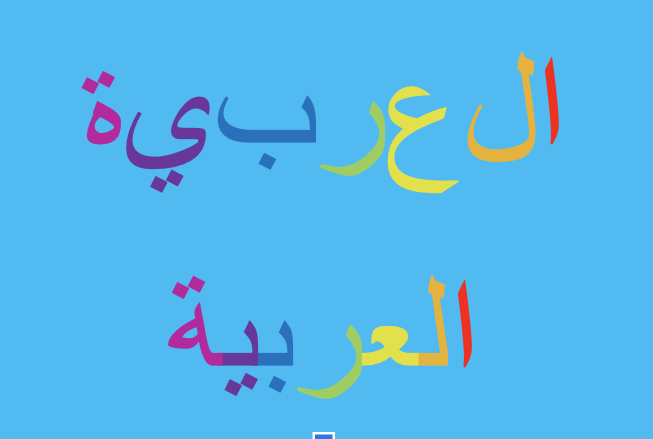

# Arabic-tweets-sentiment-analysis

----
## Marwah Faraj 

[Linkedin](https://www.linkedin.com/in/marwah-faraj-4272b4203/) | [Github](https://github.com/marwahfaraj) | [E-mail](marwah.faraj777@gmail.com) |
[Arabic tweets Dataset](https://www.kaggle.com/imranzaman5202/arabic-twitter-sentiment-analysis) |
[Poject Presentation](https://docs.google.com/presentation/d/1d0JpkFl4v2SmU5rNBB0BBUtDjkcjWBKW0OpI3TrwZPw/edit#slide=id.ge29597d775_0_1)
----
# Table of Contents
1. [Background and Motivation](#background-and-motivation)
2. [Data](#data)  
    - [Description](#description)
    - [Pipline](#pipline)  
   
5. [Exploration](#exploration)
6. [Visualization](#visualization)
7. [Machine Learning](#ML)
8. [Further Study](#further-study)

## Background and Motivation
This dataset consist of data From Arabic tweets, and it is contain of 56812 rows and 2 columns. I’m useing NLP(Natural language processing) and imlpement sentiment analysis and then use Machine Learning Algorthims: Naive Bayes(Multinomial Naive Bayes, Gaussian Naive Bayes), Ridge Classifier, and Logistic Regression) and Deap Learning algorthims: Multi-Layer Perceptron (MLP) and Convolutional Neural Nets (CNN), to predict whether the comment is postive or negative.

----
## Data
This dataset consists of data from Arabic tweets, and it has 56 thousand tweets. It contain a positive tweets and negative tweets. I’m using NLP(Natural language processing) and implement sentiment analysis and then use Machine Learning Algorithms to classify whether the comment is positive or negative.

## Description
# Arabic Script
Written right-to-left
Letters have contextual variants
Used to write many languages besides Arabic: Persian, Kurdish, Urdu, etc.

# The main challenges for Arabic Language Processing:
1- Orthographic ambiguity. 
2- Morphological richness. 
3- Dialectal variation. 
4- Orthographic inconsistency. 
5- Resource poverty (data & tools). 
6- Limited research. 

----
## Pipline
The pandas, numpy, NLTK library, for machine learning: Multinomial Naive Bayes, Gaussian Naive Bayes, Ridge_classifier, Logstic Regression, Random Forest, for deep learning: Multilayer perseptron/ Tenseorflow, keras,  matplotlib, and seaborn software libraries was used to examine, plot and analyze this data. 

----
## Exploration
Noticed this dataset do not contian null values as shown in the dataset info, but noticed that it contains a lot of empjies. After further exploration notice that there is english words and english numbers in the dataset, and the dataset is a balance data.

# visualization
## The data status: Balance data

The arabic people use the word ‘God’ a lot in their conversation and as shown the most common word is ‘God’

For the same reason the most common word in the negative tweets is ‘God’

