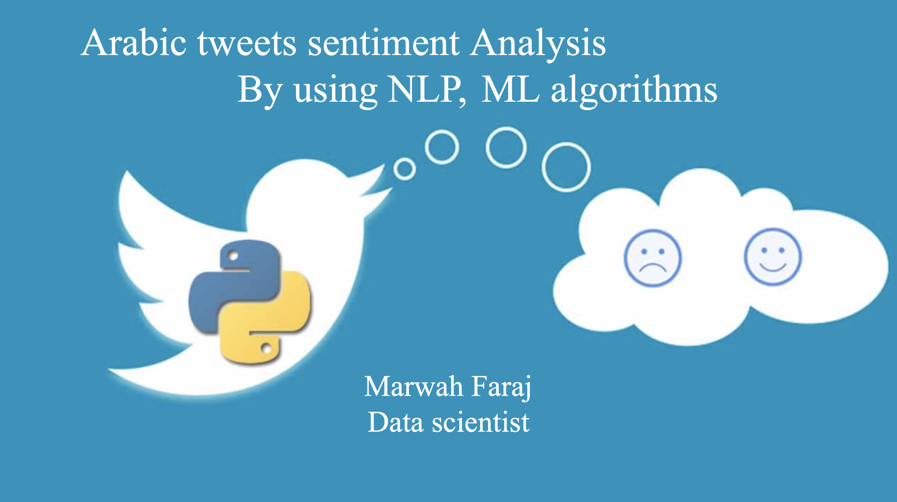

# Arabic-twittes-sentiment-analysis

----
## Marwah Faraj 

[Linkedin](https://www.linkedin.com/in/marwah-faraj-4272b4203/) | [Github](https://github.com/marwahfaraj) | [E-mail](marwah.faraj777@gmail.com) |
[Automobile Dataset](https://www.kaggle.com/toramky/automobile-dataset) |
[Poject Presentation](https://docs.google.com/presentation/d/1d0JpkFl4v2SmU5rNBB0BBUtDjkcjWBKW0OpI3TrwZPw/edit#slide=id.ge29597d775_0_1)
----
# Table of Contents
1. [Background and Motivation](#background-and-motivation)
2. [Data](#data)  
    - [Description](#description)
    - [Pipline](#pipline)  
   
5. [Exploration](#exploration)
6. [Visualization](#visualization)
7. [Machine Learning](#ML)
8. [Further Study](#further-study)

## Background and Motivation
This dataset consist of data From Arabic tweets, and it is contain of 56812 rows and 2 columns. I’m useing NLP(Natural language processing) and imlpement sentiment analysis and then use Machine Learning Algorthims: Naive Bayes(Multinomial Naive Bayes, Gaussian Naive Bayes), Ridge Classifier, and Logistic Regression) and Deap Learning algorthims: Multi-Layer Perceptron (MLP) and Convolutional Neural Nets (CNN), to predict whether the comment is postive or negative.

----
